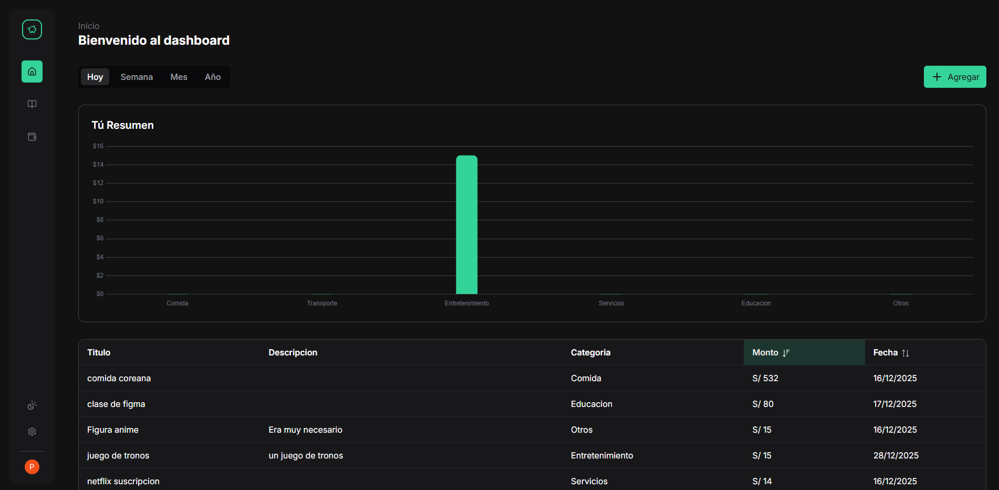

<div align="center">
  
  
  
</div>

# FinanFix

**FinanFix** es una aplicación web moderna de gestión financiera personal. Lo que comenzó como una broma y un sitio en WordPress, evolucionó a un sitio web de verdad para aprender Vue.js.

## Enlaces

- **Sitio Web:** [Visitar FinanFix](https://finanfix.vercel.app)
- **Backend:** [Repositorio Backend](https://github.com/PaoloESAN/finanfix-backend)

## Descripción

FinanFix es una plataforma integral diseñada para:

- **Gestionar tus finanzas** - Lleva un control detallado de tus ingresos y gastos con gráficos interactivos
- **Aprender a invertir** - Accede a cursos y recursos educativos sobre inversiones y bolsa de valores
- **Asistencia inteligente** - Obtén ayuda y asesoría financiera las 24 horas
- **Autenticación segura** - Sistema de login seguro con Clerk
- **Modo oscuro/claro** - Interfaz adaptable a tus preferencias
- **PWA** - Instalable como aplicación nativa en cualquier dispositivo

## Screenshots

<div align="center">




</div>

## Tecnologías

### Frontend Core & UI
*    [**Vue.js**](https://vuejs.org/)
*    [**TypeScript**](https://www.typescriptlang.org/)
*    [**Vite**](https://vitejs.dev/)
*    [**TailwindCSS**](https://tailwindcss.com/)
*    [**PrimeVue**](https://primevue.org/)
*    [**Lucide**](https://lucide.dev/)

### Backend & Database
*    [**Elysia**](https://elysiajs.com/)
*    [**Bun**](https://bun.sh/)
*    [**Prisma**](https://www.prisma.io/)
*    [**Neon**](https://neon.tech/)

### Herramientas & Features
*    [**Clerk**](https://clerk.com/)
*    [**Chart.js**](https://www.chartjs.org/)
*    [**PWA**](https://vite-pwa-org.netlify.app/)

## Instalación

### Prerrequisitos
- Node.js 18+
- npm o pnpm

### Pasos

```bash
# Clonar el repositorio
git clone https://github.com/tu-usuario/finanfix.git

# Entrar al directorio
cd finanfix

# Instalar dependencias
npm install

# Configurar variables de entorno
# Crear archivo .env con las siguientes variables:
# VITE_API_URL=tu_api_url
# VITE_CLERK_PUBLISHABLE_KEY=tu_clerk_key

# Iniciar en desarrollo
npm run dev
```

## Despliegue

El proyecto está configurado para desplegarse en **Vercel**. Simplemente conecta tu repositorio y Vercel se encargará del resto.

## Licencia

Este proyecto está bajo la Licencia MIT.
